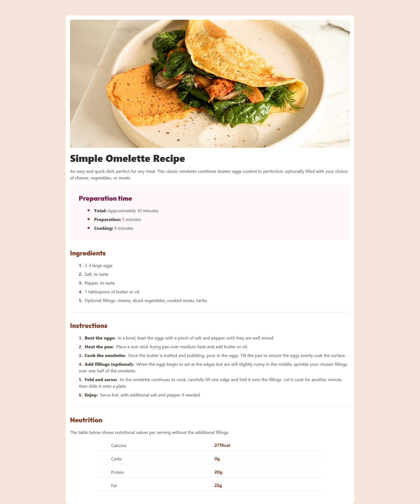
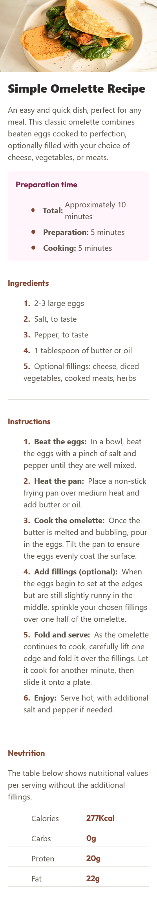

# Frontend Mentor - Recipe page solution

This is a solution to the [Recipe page challenge on Frontend Mentor](https://www.frontendmentor.io/challenges/recipe-page-KiTsR8QQKm). Frontend Mentor challenges help you improve your coding skills by building realistic projects.

## Table of contents

- [Overview](#overview)
  - [The challenge](#the-challenge)
  - [Screenshot](#screenshot)
  - [Links](#links)
- [My process](#my-process)
  - [Built with](#built-with)
  - [What I learned](#what-i-learned)
  - [Continued development](#continued-development)
  - [Useful resources](#useful-resources)
- [Author](#author)
- [Acknowledgments](#acknowledgments)

**Note: Delete this note and update the table of contents based on what sections you keep.**

## Overview

### Screenshot




### Links

- Solution URL: [Add solution URL here](https://github.com/bakryelzzubair/recipe-page-main)
- Live Site URL: [Add live site URL here](https://recipe-page-main-iota-ochre.vercel.app/)

## My process

### Built with

- Semantic HTML5 markup
- CSS pseudo elements to automated numbering
- Flexbox
- Mobile-first workflow
- [React](https://reactjs.org/) - JS library
- [tailwind css](https://tailwindcss.com/) - Css framework for styles

### What I learned

Use this section to recap over some of your major learnings while working through this project. Writing these out and providing code samples of areas you want to highlight is a great way to reinforce your own knowledge.

To see how you can add code snippets, see below:

```css
.auto-numbering li {
  counter-increment: counter-numbering;
}

.auto-numbering li::before {
  content: counter(counter-numbering) ". ";
  color: var(--color-primary-Brown-800);
  display: inline-block;
  margin-right: 8px;
  font-weight: bold;
}
```

### Useful resources

- [Elzero web school ](https://www.youtube.com/results?search_query=elzero+web+school) - This helped me for learing how to auto numbering with lists. I really liked this stuff and will use it going forward.

## Author

- Website - [Add your name here](https://bakryelzzubair-5ii7z7fzk-belzzubairs-projects.vercel.app/)
- Frontend Mentor - [@yourusername](https://www.frontendmentor.io/profile/yourusername)
